<h1 align="center">

<br>
CriticLean: Critic-Guided Reinforcement Learning for Mathematical Formalization
</h1>

<div align="center">


</div>

<p align="center">
  <a href="https://arxiv.org/pdf/2507.06181"><b>[📄 Paper]</b></a> •
  <a href="https://huggingface.co/m-a-p/CriticLeanGPT-Qwen3-8B-RL"><b>[🤗 CriticLeanGPT]</b></a> •
  <a href="https://huggingface.co/datasets/m-a-p/CriticLeanInstruct"><b>[🧐 CriticLeanInstruct]</b></a> •
  <a href="https://huggingface.co/datasets/m-a-p/CriticLeanBench"><b>[📊 CriticLeanBench]</b></a> •
  <a href="https://huggingface.co/datasets/m-a-p/FineLeanCorpus"><b>[📦 FineLeanCorpus]</b></a>
  <br>
  <!-- <a href="https://twitter.com/TODO"><b>[🐦 Twitter]</b></a> • -->
  <!-- <a href="#-quick-start">Quick Start</a> • -->
  <!-- <a href="#%EF%B8%8F-citation">Citation</a> -->
</p>

<p align="center">
Repo for "<a href="https://arxiv.org/pdf/2507.06181" target="_blank">CriticLean: Critic-Guided Reinforcement Learning for Mathematical Formalization</a>"
</p>


## 💡 Introduction
The formalization of mathematical statements into executable code for theorem provers like Lean 4 remains a critical challenge in computational mathematics. While existing methods have made progress in autoformalization, they often struggle with accuracy—particularly for complex problems requiring deep semantic understanding. This paper argues that the underexplored "critic" phase, which evaluates whether generated formalizations align with original mathematical intent, is essential for advancing this field.

To address these limitations, we introduce **CriticLean** , a framework prioritizing a critic-driven pipeline. At its core is **CriticLeanGPT** , a reinforcement learning-based model trained to assess the semantic fidelity of Lean 4 outputs against natural language statements. Our iterative process combines feedback from both the Lean compiler and CriticLeanGPT to refine formalizations, enhancing robustness through successive improvements.

We also present **CriticLeanBench** , a benchmark containing 500 paired natural language and Lean 4 statements (250 correct, 250 incorrect), enabling rigorous evaluation of critic models. Experiments show CriticLeanGPT outperforms state-of-the-art open-source and closed-source models in accuracy.

Building on this pipeline, we develop **FineLeanCorpus** , an open-source dataset of 285,957 verified Lean 4 statements. Compared to prior datasets, it offers greater diversity in mathematical domains, difficulty levels, and quality, validated through iterative critical feedback.

By centering the formalization process on semantic validation, our work advances the reliability of automated theorem proving and provides scalable resources for future research in mathematical AI.
<p align="center">
    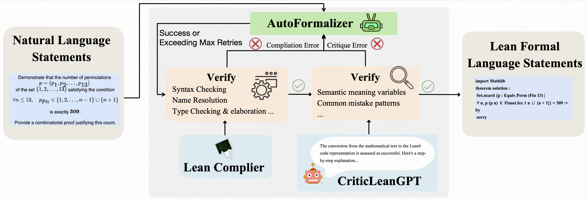
        <br>
    <em>Figure 1: Illustration of CriticLean framework based on Critic-Guided Reinforcement Learning for Mathematics Autoformalization.</em>
</p>

## Framework Overview
### 💻 CriticLeanGPT Model
#### 📋 CriticLeanInstruct

The CriticLeanInstruct dataset suite consists of several JSONL files, each serving specific purposes in the model training pipeline. Here's a breakdown of each file:

| File Name | Description |
|-----------|-------------|
| `CriticLean_12K` | All of our critic lean data. |
| `CriticLean_4K` | Seed Data. A subset of the CriticLean_12K, specifically used as our Reinforcement Learning (RL) dataset. |
| `CriticLean_Mix_48K` | An expanded mixed dataset including:<br>- `CriticLean_12K`<br>- 18k math data sampled from [OpenR1-Math-220k](https://huggingface.co/datasets/open-r1/OpenR1-Math-220k)<br>- 18k code data sampled from [OpenThoughts-114k-Code_decontaminated](https://huggingface.co/datasets/open-r1/OpenThoughts-114k-Code_decontaminated) |
| `CriticLean_Mix_16K` | A mixed dataset including:<br>- `CriticLean_4K`<br>- 6k math data sampled from [OpenR1-Math-220k](https://huggingface.co/datasets/open-r1/OpenR1-Math-220k)<br>- 6k code data sampled from [OpenThoughts-114k-Code_decontaminated](https://huggingface.co/datasets/open-r1/OpenThoughts-114k-Code_decontaminated) |

#### 🍭 Associated Model Variants

We've trained several model variants using the CriticLean dataset to demonstrate its effectiveness. Below is a summary of the training configurations:

| Base Model | SFT Applied? | SFT Data | RL Applied? | RL Data | CriticLeanGPT Model Name |
|------------|--------------|----------|-------------|---------|------------|
| Qwen2.5-Instruct | Yes | `CriticLean_4K` | No | * | Qwen2.5-Instruct-SFT(Critic Only) |
| Qwen2.5-Instruct | Yes | `CriticLean_Mix_16K` | No | * | Qwen2.5-Instruct-SFT(16K) |
| Qwen2.5-Instruct | Yes | `CriticLean_Mix_48K` | No | * | Qwen2.5-Instruct-SFT |
| Qwen2.5-Instruct | Yes | `CriticLean_Mix_48K` | Yes | `CriticLean_4K` | Qwen2.5-Instruct-SFT-RL |
| Qwen2.5-Instruct | No | * | Yes | `CriticLean_4K` | Qwen2.5-Instruct-RL |
| Qwen3 | No | * | Yes | `CriticLean_4K` | Qwen3-RL |

### 📋 CriticLeanBench
#### Overview

CriticLeanBench is a comprehensive benchmark designed to evaluate the critical reasoning capabilities of models in translating natural language mathematical statements into formally verified theorem declarations in Lean 4. This benchmark focuses on assessing whether generated Lean 4 code accurately reflects the semantic intent of original mathematical statements, addressing a key gap in existing evaluation frameworks for mathematical autoformalization.
- **Dual Focus**: Integrates both critic capabilities and Lean 4 formal verification, distinguishing itself from existing benchmarks
- **Diverse Coverage**: Includes problems from various mathematical domains and difficulty levels
- **Structured Errors**: Incorrect samples are designed to exhibit common error patterns in mathematical formalization
- **Human-Verified**: All samples undergo rigorous human validation to ensure quality and accuracy

<p align="center">
    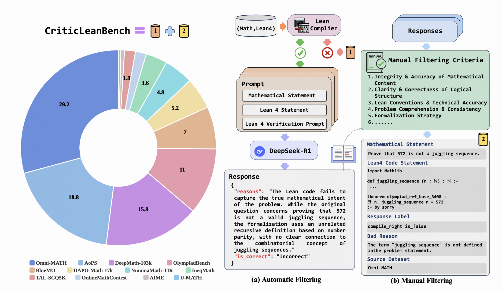
    <br>
    <em>Figure 2: An overview for the CriticLeanBench construction.
    </em>
</p>

#### Statistics
With 500 carefully curated problem pairs (250 correct and 250 incorrect formalizations), CriticLeanBench provides a rigorous testbed for models tasked with evaluating the correctness of mathematical formalizations. Each problem features relatively lengthy inputs (average 700.94 tokens), challenging models to process and understand complex mathematical reasoning.

CriticLeanBench is unique in its integration of Lean 4 specific evaluation and its focus on mathematical formalization correctness.

<p align="center">
    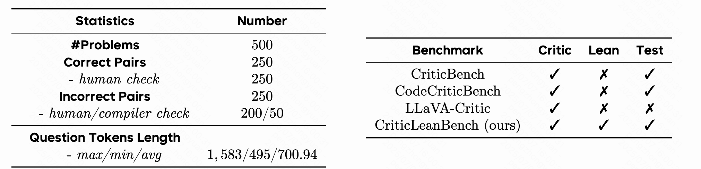
    <br>
    <em>Table 1 : Dataset statistics and comparison of various code benchmark datasets.
    </em>
</p>


##### Dataset Structure

Each entry in CriticLeanBench contains:
- A natural language mathematical statement
- A corresponding Lean 4 formalization
- A label indicating whether the formalization is semantically correct
- Detailed error annotations for incorrect samples (where applicable)


##### Evaluation Metrics

We recommend using the following metrics when evaluating models on CriticLeanBench:
- Accuracy (ACC)
- True Positive Rate (TPR)
- False Positive Rate (FPR)
- True Negative Rate (TNR)
- False Negative Rate (FNR)

#### Evaluation of SOTA LLMs
<p align="center">
    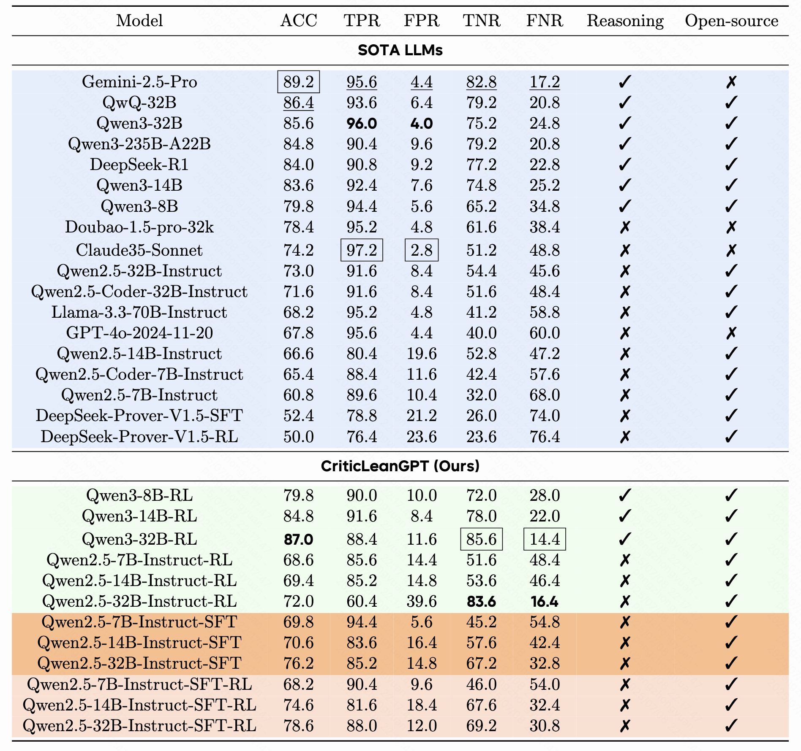
    <br>
    <em>
        Table 2: 
        <strong>Performance on CriticLeanBench.</strong> 
        The best, the second-best and the third-best scores for each indicator are shown in 
        <span style="border:1px solid;padding:2px;">box</span>, 
        <strong>bold</strong> and 
        <u>underlined</u>, respectively.
    </em>
</p>

<p align="center">
    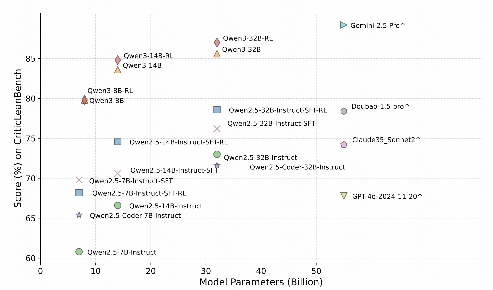
    <br>
    <em>Figure 3: Scaling Analysis of LLMs on CriticLeanBench. <span style="border:1px solid;padding:4px;">ˆ</span> denoted closed-source LLMs.</em>
</p>

## 📋 FineLeanCorpus
### Overview
**FineLeanCorpus** is the **largest high-quality** dataset of natural language mathematical statements paired with their formalizations in Lean 4, comprising 285,957 entries. This dataset is designed to advance research in mathematical autoformalization—the translation of natural language mathematics into formal, machine-verifiable code.

The corpus is distinguished by its:
- **Scale**: 285K entries, significantly larger than existing Lean 4 problem sets
- **Quality**: 84% accuracy verified through manual sampling
- **Diversity**: Coverage across multiple mathematical domains and difficulty levels
- **Rigorous validation**: Each entry passes both syntactic checks (via Lean compiler) and semantic verification (via CriticLean model)
### Statistics
FineLeanCorpus draws from diverse mathematical sources:
<p align="center">
    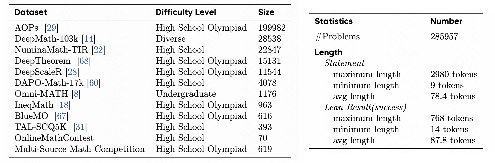
    <br>
    <em>Table 3: Different sources and Dataset statistics of FineLeanCorpus.
    </em>
</p>

### Comparison with the Lean-Workbook Dataset
<p align="center">
    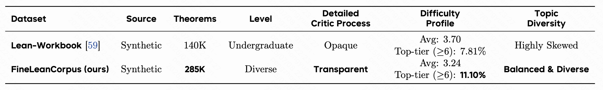
    <br>
    <em>Table 4: Comparison of dataset statistics. FineLeanCorpus offers a transparent critic process, a higher proportion of top-tier problems, and a more balanced and diverse topic distribution compared to the highly skewed Lean-Workbook.
    </em>
</p>

<p align="center">
    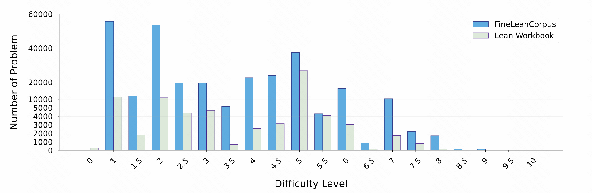
    <br>
    <em>Figure 4: Comparison of dataset statistics. FineLeanCorpus offers a transparent critic process, a higher proportion of top-tier problems, and a more balanced and diverse topic distribution compared to the highly skewed Lean-Workbook.
    </em>
</p>

<p align="center">
    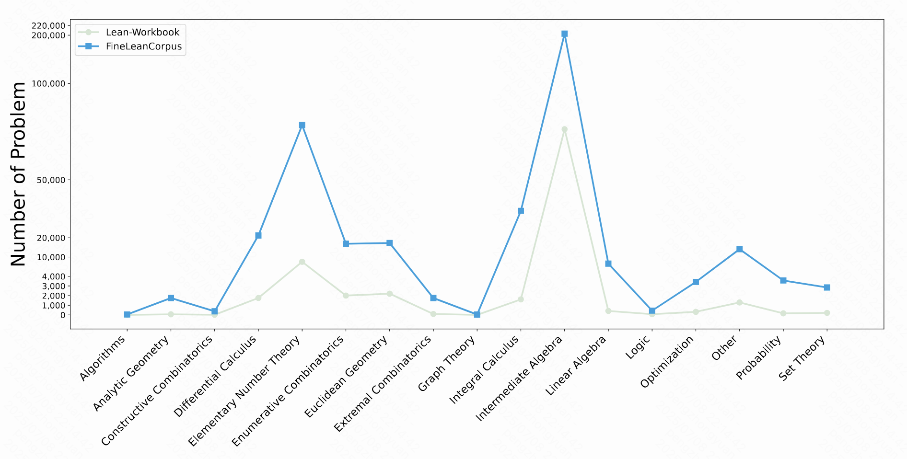
    <br>
    <em>Figure 5: Math Domain Distributions Comparison: FineLeanCorpus vs. Lean-Workbook.
    </em>
</p>

### Human Evaluation
<p align="center">
    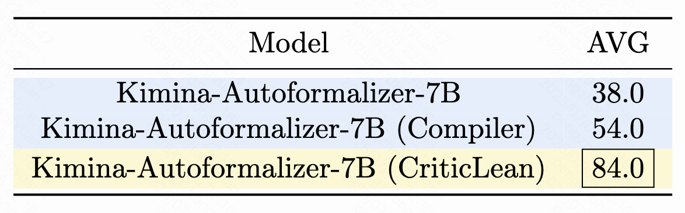
    <br>
    <em>Table 5: 
    <strong>Human evaluation accuracy results for autoformalization performance:</strong> Comparing the base model, base model with compiler feedback and our aut- oformalization pipeline. The best score is highlighted in <span style="border:1px solid;padding:2px;">box</span>.
    </em>
</p>

<p align="center">
    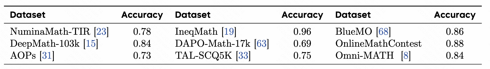
    <br>
    <em>Table 6: Results of manual sampling inspection on dataset accuracy rates.
    </em>
</p>


### 🔗 Referenced Datasets & Links

FineLeanCorpus includes a limited portion of data sourced from the following datasets:

- **[AOPs](https://arxiv.org/abs/2501.14275)**
- **[DeepMath-103k](https://huggingface.co/datasets/zwhe99/DeepMath-103K)**
- **[NuminaMath-TIR](https://huggingface.co/datasets/AI-MO/NuminaMath-TIR)**
- **[DeepTheorem](https://arxiv.org/abs/2505.23754)**
- **[DeepScaleR](https://huggingface.co/agentica-org/DeepScaleR-1.5B-Preview)**
- **[DAPO-Math-17k](https://huggingface.co/datasets/BytedTsinghua-SIA/DAPO-Math-17k)**
- **[Omni-Math](https://omni-math.github.io/)**
- **[InwqMath](https://arxiv.org/pdf/2506.07927)**
- **[BlueMO](https://github.com/yifanzhang-pro/BlueMO)**
- **[TAL-SCQ5K](https://huggingface.co/datasets/math-eval/TAL-SCQ5K)**
- **[OnlineMathContest](https://huggingface.co/datasets/p1atdev/OnlineMathContest-2502/tree/52e219db1db05463810528e0cac1a5bc998498d6)**
- **[Multi-Source Math Competition]()**


---
## 📜 License
Apache-2.0 license
## ☕️ Citation
If you find this repository helpful, please consider citing our paper:
```
@misc{peng2025criticleancriticguidedreinforcementlearning,
      title={CriticLean: Critic-Guided Reinforcement Learning for Mathematical Formalization}, 
      author={Zhongyuan Peng and Yifan Yao and Kaijing Ma and Shuyue Guo and Yizhe Li and Yichi Zhang and Chenchen Zhang and Yifan Zhang and Zhouliang Yu and Luming Li and Minghao Liu and Yihang Xia and Jiawei Shen and Yuchen Wu and Yixin Cao and Zhaoxiang Zhang and Wenhao Huang and Jiaheng Liu and Ge Zhang},
      year={2025},
      eprint={2507.06181},
      archivePrefix={arXiv},
      primaryClass={cs.CL},
      url={https://arxiv.org/abs/2507.06181}, 
}
```
