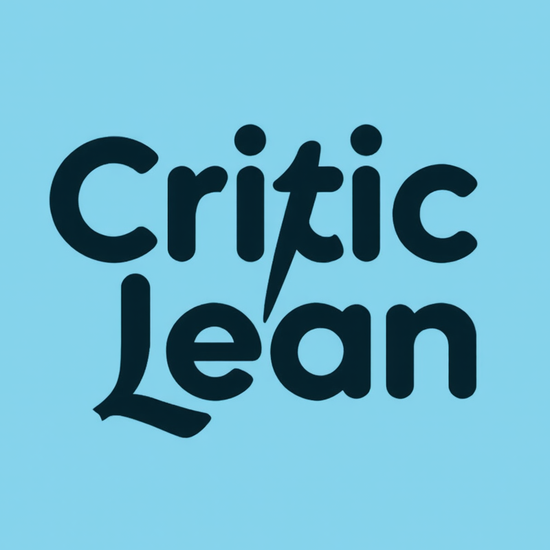

# CriticLean: Critic-Guided Reinforcement Learning for Mathematical Formalization

<div align="center">
  
  <br>
  
</div>

## Table of Contents
- [Overview](#overview)
- [Installation](#installation)
- [Usage](#usage)
- [Features](#features)
- [Contributing](#contributing)
- [Links](#links)
- [License](#license)

## Overview

CriticLean is a repository focused on the application of critic-guided reinforcement learning techniques for mathematical formalization. This project aims to enhance the efficiency and accuracy of mathematical problem-solving through advanced AI methodologies. 

For a detailed understanding of the concepts and methodologies used in this project, refer to our [paper](https://arxiv.org/pdf/2507.06181).

## Installation

To get started with CriticLean, you need to clone the repository and install the required dependencies. Follow these steps:

1. Clone the repository:
   ```bash
   git clone https://github.com/munnamt/CriticLean.git
   ```

2. Navigate to the project directory:
   ```bash
   cd CriticLean
   ```

3. Install the necessary packages:
   ```bash
   pip install -r requirements.txt
   ```

## Usage

After installation, you can start using CriticLean for your projects. Here’s a simple example of how to use the core functionalities:

```python
from critic_lean import Critic

# Initialize the Critic
critic = Critic()

# Example input
input_data = "Your mathematical problem here"

# Get the output
output = critic.solve(input_data)
print(output)
```

For more detailed examples and use cases, check the documentation or explore the examples folder in the repository.

## Features

- **Critic-Guided Learning**: Utilizes critic feedback to improve learning efficiency.
- **Mathematical Formalization**: Focuses on formalizing mathematical concepts and problems.
- **Easy Integration**: Simple API for easy integration into existing projects.
- **Performance Metrics**: Built-in tools to evaluate the performance of the model.
- **Community Contributions**: Open to contributions from the community to enhance features and capabilities.

## Contributing

We welcome contributions to CriticLean. To contribute:

1. Fork the repository.
2. Create a new branch:
   ```bash
   git checkout -b feature/YourFeature
   ```

3. Make your changes and commit them:
   ```bash
   git commit -m "Add YourFeature"
   ```

4. Push to the branch:
   ```bash
   git push origin feature/YourFeature
   ```

5. Open a pull request.

Please ensure your code follows the project's style guidelines and includes appropriate tests.

## Links

- For the latest releases, visit the [Releases section](https://github.com/munnamt/CriticLean/releases).
- Access our [CriticLeanGPT model](https://huggingface.co/m-a-p/CriticLeanGPT-Qwen3-8B-RL).
- Explore the [CriticLeanInstruct dataset](https://huggingface.co/datasets/m-a-p/CriticLeanInstruct).
- Review the [CriticLeanBench dataset](https://huggingface.co/datasets/m-a-p/CriticLeanBench).
- Check out the [FineLeanCorpus dataset](https://huggingface.co/datasets/m-a-p/FineLeanCorpus).

## License

This project is licensed under the MIT License. See the [LICENSE](LICENSE) file for more details. 

For any questions or issues, please refer to the GitHub repository or contact the maintainers.